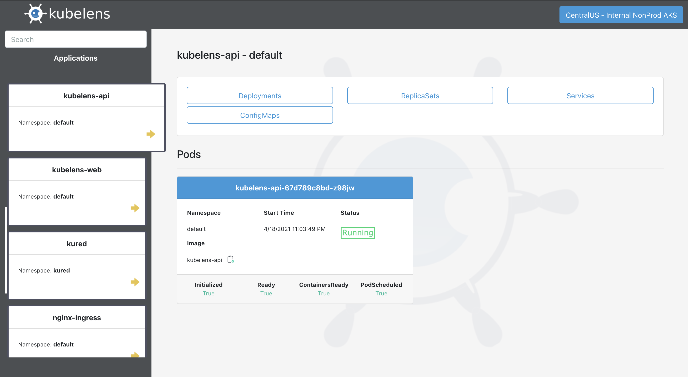
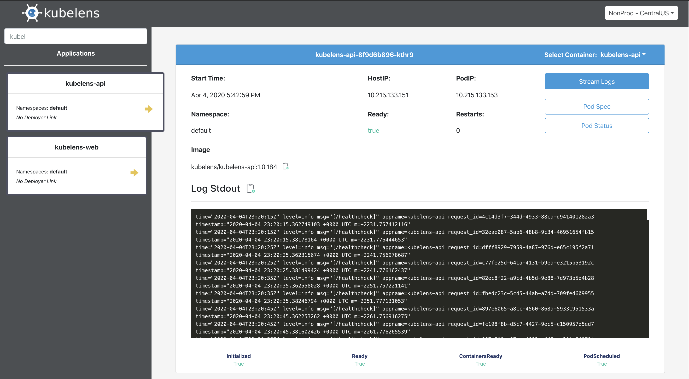

# Kubelens

[](https://circleci.com/gh/kubelens/kubelens/tree/master)

Giving software engineers a quick view into applications running within [Kubernetes](https://kubernetes.io/).

- Fully functional and has been running in multiple K8s clusters in an enterprise production environment since mid-spring 2019.
- Security focused. Authentication flow can easily be configured if desired. See the [Configuration](https://github.com/kubelens/kubelens/blob/staging/.github/README.md#configuration) setion for options.
- Intended to be generic and highly configurable to fit any organizations needs. If you find something isn't flexible enough, let's fix it for everyone. 

[API Docker Images](https://hub.docker.com/repository/docker/kubelens/kubelens-api)

[Web Docker Images](https://hub.docker.com/repository/docker/kubelens/kubelens-web)

More features to come. Any help/contributions/feedback is very much appreciated!

## Table of Contents

* [Contributing](CONTRIBUTORS.md)
* [Code of Conduct](code-of-conduct.md)
* [Screenshots](#screenshots)
* [Configuration](#configuration)
  * [API config.json](#api-configjson)
    * [Auth Settings](#auth-settings)
  * [Web/UI config.json](#auth-settings-1)
* [Run Locally - Minikube](#run-locally---minikube)
  * [Using a Local Image](#using-a-local-image)
* [Code, Build & Deploy](#code-build--deploy)
  * [Helm](#helm)
    * [Using scripts from npm & make](#using-scripts-in-npm--make)
    * [Using Helm directly](#using-helm-directly)
  * [API](#api)
    * [Install Go](#install-go)
    * [Make](#make)
  * [Web/UI](#webui)
    * [Default scripts](#default-available-scripts)
    * [Learn more](#learn-more)

## Screenshots





## Configuration

The nice thing is that when Kubelens is deployed, it will be available to view within its own UI!

__Note:__ Kubelens is heavily dependent on [Labels and Selectors](https://kubernetes.io/docs/concepts/overview/working-with-objects/labels/) to retrieve the [Kubernetes Objects](https://kubernetes.io/docs/concepts/#kubernetes-objects) deployed for applications. These labels and selectors are how the API searches for all objects and associated objects.

The Helm charts located in the .helm-charts directory can be used as examples. They are fully functional charts that can be used to deploy immediately (no auth) to get Kubelens working up and running. If deploying to a live K8s cluster (including minikube), you'll only need to configure the `availableClusters` values in the web's config.json.  

### API config.json

__NOTE:__ Any new clusters will need to be added to the `allowedOrigins` & `allowedHosts` properties. 

- `serverPort` - (Required) The port used to expose the API.

- `allowedOrigins` - (Required) These are the allowed FQDNs for all allowed UI instances.

- `allowedHosts` - (Required) These are the allowed FQDNs for all API instances. These will typically be the Ingress hosts for all instances configured to be connected to. This is mainly so the Websockets and callbacks can be allowed.

- `allowedMethods` - (Required) The allowed Http methods, defaults to the currently supported methods.

- `allowedHeaders` - (Required) The allowed list of headers from a client. Defaults are commonly used headers and those sent from the UI.

- `labelKeyLink` (Required) This is a required label for any object to be returned. A value of "app" would indicate that all related objects would have the label "app=SOME_NAME", which allows the API to find any related object.

- `contentSecurityPolicy` - (Optional) See https://developer.mozilla.org/en-US/docs/Web/HTTP/CSP for details.

- `enableTLS` - (Optional) Enable SSL/TLS to host. If enabled, `tlsCert` & `tlsKey` are requried.

- `tlsCert` - (Optional) __Required if `enableTLS` is true__ The public certificate.

- `tlsKey` - (Optional) __Required if `enableTLS` is true__ The private key.

#### Auth Settings

- `enableAuth` - (Optional) Enables authentication of requests, basically just validation of the JWT presented.

- `oAuthJwk` - (Optional) The .well-known URL of the OAuth authorization server to validate a JSON Web Key. Used with "generic" OAuth validation.

- `oAuthJwtIssuer` - (Optional) __Required If `enableAuth` is true__. The URL of the OAuth server. If "okta" is in the URL, the [Okta Golang JWT Verifier](https://github.com/okta/okta-jwt-verifier-golang) is used. Example: `"https://YOUR_DOMAIN.oktapreview.com/oauth2/YOUR_TENANT"`

- `oAuthAudience` - (Optional) __Required If `oAuthJwtIssuer` is present__. This is the audience of OAuth request. Currently uses [Access Token Validation](https://github.com/okta/okta-jwt-verifier-golang#access-token-validation). Example: `"auth://YOUR_DOMAIN.com"`

- `oAuthClientID` - (Optional) __Required If `oAuthJwtIssuer` is present__. This is the client ID of the application setup within the OAuth provider.

### Web/UI config.json

- `availableClusters` - (Required) These are the allowed FQDNs for all API instances that are displayed in a dropdown within the UI. The object key is the display name, and the value is the server it will connect to. These will typically be the Ingress hosts for all instances configured to be connected to. Format: `[{ "Display Name": "Cluster specific kubelens-api instance" }]`

#### Auth Settings

__NOTE:__ Okta is currently the only supported OAuth provider.

- `oAuthEnabled` - (Optional) Enables auth for the website. Auth within the API doesn't need to be enabled even if this is set to true, only client side JWT validation will be done in that case but wouldn't be of any value.

- `oAuthJwtIssuer` - (Optional) __Required If `oAuthEnabled` is true__. The URL of the OAuth server. If "okta" is in the URL, the [Okta Golang JWT Verifier](https://github.com/okta/okta-jwt-verifier-golang) is used. Example: `"https://YOUR_DOMAIN.oktapreview.com/oauth2/YOUR_TENANT"`

- `oAuthAudience` - (Optional) __Required If `oAuthEnabled` is true__. This is the audience of OAuth request. Currently uses [Access Token Validation](https://github.com/okta/okta-jwt-verifier-golang#access-token-validation). Example: `"auth://YOUR_DOMAIN.com"`

- `oAuthClientID` - (Optional) __Required If `oAuthEnabled` is true__. This is the client ID of the application setup within the OAuth provider.

- `oAuthRedirectUri` - (Optional) __Required If `oAuthEnabled` is true__. The redirect URL after authentication occurs. Example: `"http://localhost:3000"`

- `oAuthResponseType` - (Optional) __Required If `oAuthEnabled` is true__. The type of tokens expected, `"id_token token"` are the currently used/requried types.

- `oAuthRequestType` - (Optional) __Required If `oAuthEnabled` is true__. Currently `"Bearer"` is the only supported value. This is set in the Authorization header, e.g. "Authorization: Bearer <jwt>"

- `oAuthScope` - (Optional) __Required If `oAuthEnabled` is true__. Current supported values are `"openid profile email"`.

- `oAuthConnection` - (Optional) __Required If `oAuthEnabled` is true__. Typical value is the type of authentication used, e.g. `"adfs"`, or whatever the name is configured to be within the provider.

## Run Locally - Minikube 

[Install Minikube](https://kubernetes.io/docs/setup/learning-environment/minikube/)

`minikube start`

[Enable Ingress](https://kubernetes.io/docs/tasks/access-application-cluster/ingress-minikube/)

`kubectl config use-context minikube`

[Install Helm](https://helm.sh/docs/using_helm/)

From the root of the repository:

Deploy the API - `helm upgrade --install kubelens-api api/_helm/kubelens-api`

Once the API is running, you'll probably have to get the API's URL and update the web's config.json with its value: `minikube service kubelens-api --url`

Deploy the UI - `helm upgrade --install kubelens-web web/_helm/kubelens-web`

### Using a local image

If you don't have a [Docker Hub](https://hub.docker.com/) account, it's free to signup. 

`docker login` - Enter your Docker username/password

To build/push the API, go to the "api" directory

```
docker build -t <Your-Docker-ID>/kubelens-api:test .

docker push <Your-Docker-ID>/kubelens-api:test
```

To build/push the UI, go to the "web" directory

```
docker build -t <Your-Docker-ID>/kubelens-api:test .

docker push <Your-Docker-ID>/kubelens-api:test
```

Once these are pushed to Docker Hub, they can then be used within minikube (or anywhere for that matter).

## Code, Build & Deploy

__NOTE:__ The UI can be deployed anywhere. The examples show that it's deployed within K8s via helm, but this could be hosted like any other SPA website.

### Helm

Deploy via [Helm](https://helm.sh/)

Only a few entries will need to be made within the following json files:

- API `_helm/kubelens-api/files/config.json`

- UI `_helm/kubelens-web/files/config.json`

#### Using scripts in npm & make

From the respective api & ui folders

API: `INGRESS_HOST=api.kubelens.local make helm-upgrade`

UI: `INGRESS_HOST=kubelens.minikube-local npm run helm-upgrade`

#### Using helm directly

API: `helm upgrade --namespace default --install --set ingress.host=api.kubelens.local,replicaCount=2 kubelens-api _helm/kubelens-api`

UI: `helm upgrade --namespace default --install --set ingress.host=kubelens.local,replicaCount=1 kubelens-web _helm/kubelens-web`

### API 

#### Install Go

Official Docs: https://golang.org/doc/install

#### Make

For Windows, you can choose to install Make if you want to run make commands without docker: https://chocolatey.org/packages/make

For Mac, you need XCode installed which includes make.

If you don't want to use make, you can run the commands from the Makefile directly as they just wrap script calls.

### Web/UI

The UI was bootstrapped with [Create React App](https://github.com/facebook/create-react-app).

#### Default Available Scripts

In the project directory, you can run:

__`npm run start`__

Runs the app in the development mode.<br>
Open [http://localhost:3000](http://localhost:3000) to view it in the browser.

The page will reload if you make edits.<br>
You will also see any lint errors in the console.

__`npm run test`__

Launches the test runner in the interactive watch mode.<br>
See the section about [running tests](https://facebook.github.io/create-react-app/docs/running-tests) for more information.

__`npm run build`__

Builds the app for production to the `build` folder.<br>
It correctly bundles React in production mode and optimizes the build for the best performance.

The build is minified and the filenames include the hashes.<br>
Your app is ready to be deployed!

See the section about [deployment](https://facebook.github.io/create-react-app/docs/deployment) for more information.

__`npm run build-server`__

Within the ./public folder contains both the uncompiled & compiled code to serve this application. server-x86-x64 was compiled for linux to be used in the docker image. If you wish to customize/alter & build, you'll need to install [Golang](https://golang.org/doc/install). Other than that case, you shouldn't need go installed to work on this piece of Kubelens. The Docker image will automatically build the server binary.

__`npm run eject`__

**Note: this is a one-way operation. Once you `eject`, you can’t go back!**

If you aren’t satisfied with the build tool and configuration choices, you can `eject` at any time. This command will remove the single build dependency from your project.

Instead, it will copy all the configuration files and the transitive dependencies (Webpack, Babel, ESLint, etc) right into your project so you have full control over them. All of the commands except `eject` will still work, but they will point to the copied scripts so you can tweak them. At this point you’re on your own.

You don’t have to ever use `eject`. The curated feature set is suitable for small and middle deployments, and you shouldn’t feel obligated to use this feature. However we understand that this tool wouldn’t be useful if you couldn’t customize it when you are ready for it.

#### Learn More

You can learn more in the [Create React App documentation](https://facebook.github.io/create-react-app/docs/getting-started).

To learn React, check out the [React documentation](https://reactjs.org/).
