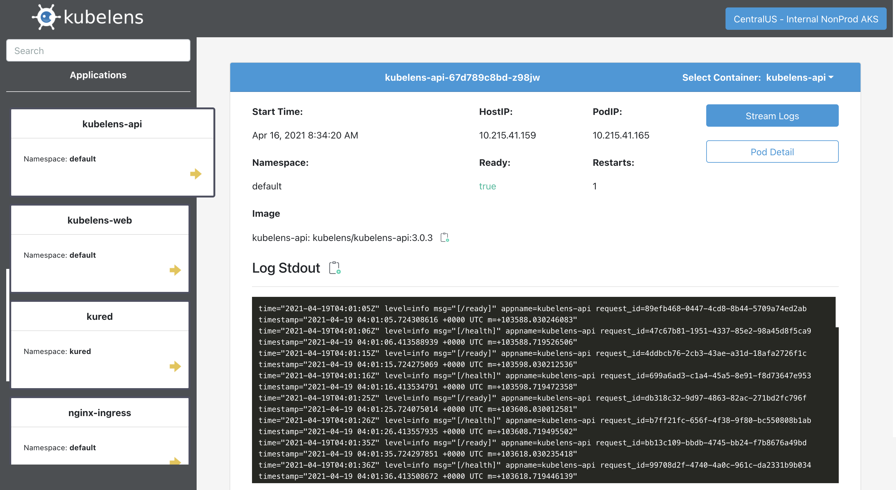

# Kubelens

Giving software engineers a quick view and logs for applications running in [Kubernetes](https://kubernetes.io/).

Let's get to the quick details.

- Fully functional and has been running in multiple K8s clusters in an enterprise production environment since mid-spring 2019.
- Security focused. Authentication & Authorization flows can easily be configured at different levels if desired. More docs to come on this. 
- Intended to be generic and highly configurable to fit any organizations needs. If you find something isn't flexible enough, let's fix it for everyone. 

More docs and features to come. Any help/contributions/feedback is very much appreciated!

## Run Locally - Minikube 

The nice thing is that when Kubelens is deployed, it will be available to view within its own UI!

[Install Minikube](https://kubernetes.io/docs/setup/learning-environment/minikube/)

`minikube start`

[Enable Ingress](https://kubernetes.io/docs/tasks/access-application-cluster/ingress-minikube/)

`kubectl config use-context minikube`

[Install Helm](https://helm.sh/docs/using_helm/)

From the root of the repository:

Deploy the API - `helm upgrade --install kubelens-api api/_helm/kubelens-api`

Deploy the UI - `helm upgrade --install kubelens-web web/_helm/kubelens-web`

## Build & Deploy

[kubelens/web](https://github.com/kubelens/kubelens/tree/staging/web#build--deploy)

[kubelens/api](https://github.com/kubelens/kubelens/tree/staging/api#build--deploy)
